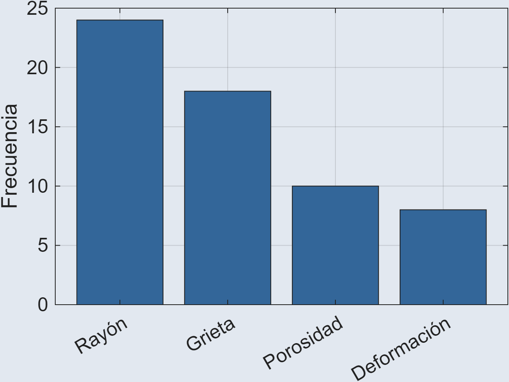
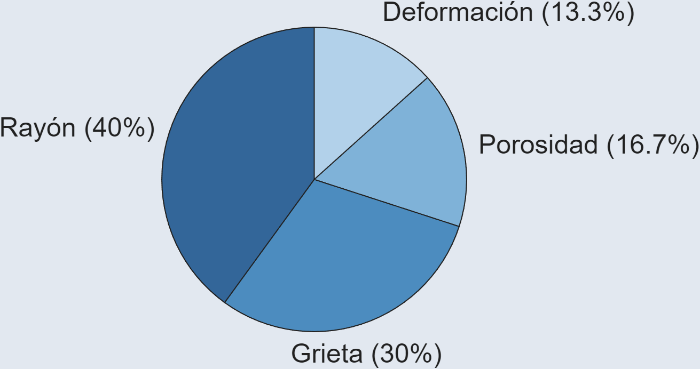
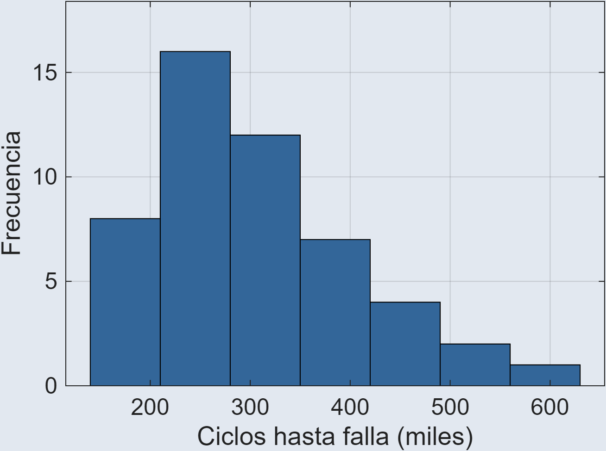
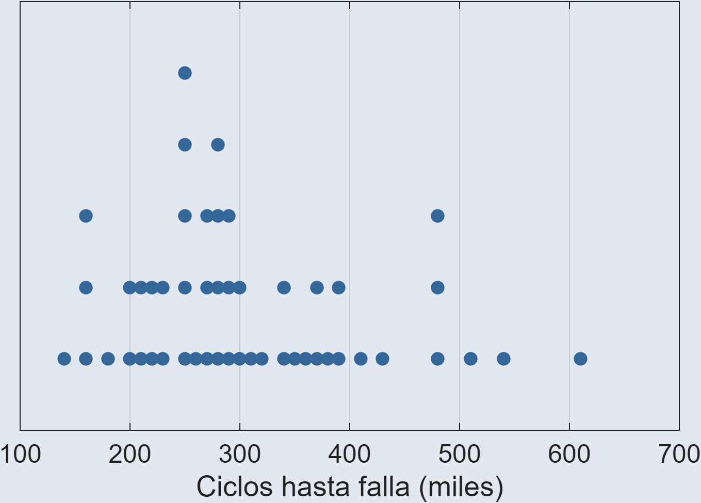
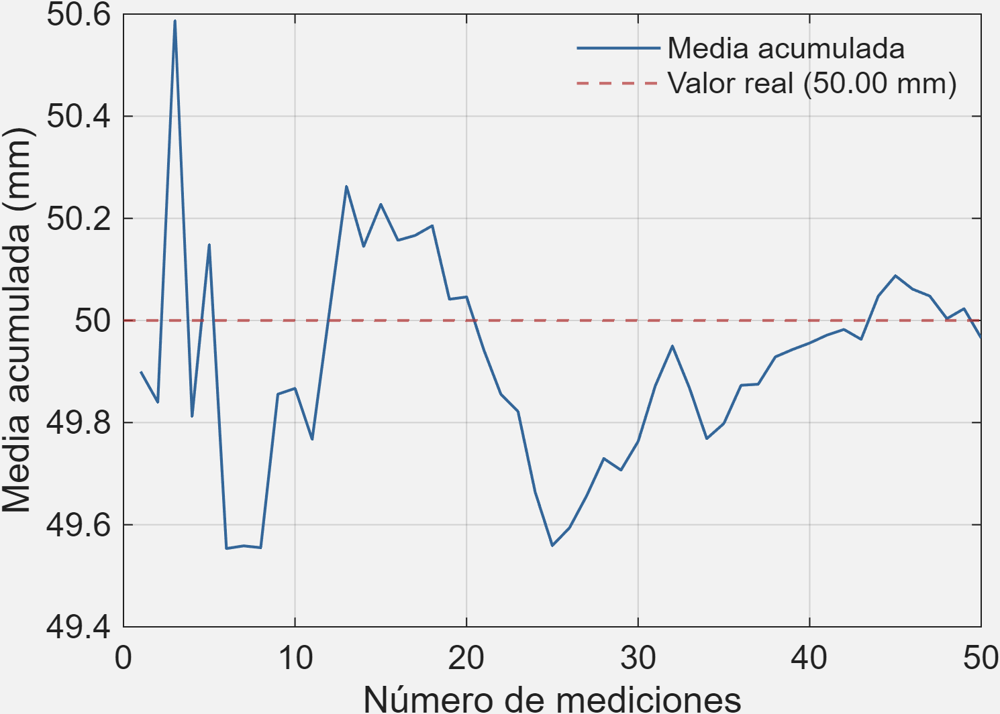

# Manejo de datos y medidas estadísticas {style="margin-top: 45px; font-size: 1.2em;"}

<h3 style="font-size: 1.0em;"> Recolección, organización y representación gráfica de datos </h3>

<h4 style="font-size: 0.6em; opacity: 0.6"> Agosto 2026 </h4>

## Unidades temáticas {background-color="#e4e4e7" style="font-size: 1.0em;"}

- **Unidad 1:** Definiciones. Manejo de datos y medidas estadísticas
- **Unidad 2:** Probabilidad y muestreo
- **Unidad 3:** Variables aleatorias discretas y continuas y sus distribuciones
- **Unidad 4:** Distribuciones muestrales. Introducción a los intervalos de confianza
- **Unidad 5:** Análisis de regresión y correlación

## Definiciones. Manejo de datos y medidas estadísticas 

**1.** Introducción y conceptos fundamentales

**2. Recolección, organización y representación gráfica de datos**

**3.** Medidas de tendencia central y posición

**4.** Medidas de dispersión y de forma

## Recolección, organización y representación gráfica de datos

1. **Fuentes de datos y obtención**
   - Diseños experimentales vs. estudios observacionales
   - Encuestas e instrumentos de medición
   - Muestreo probabilistico y no probabilistico
2. **Tablas de frecuencias**
   - Estructuración para datos no agrupados vs. agrupados
   - Reglas para determinación de los anchos de clase
3. **Gráficos para variables cualitativas y cuantitativas**
   - Representación de categorías, proporciones y atributos dicotómicos
   - Visualización de la forma, centro, dispersión y densidad de datos
4. **Sesgo y la recolección de datos**
   - Sesgo vs. error aleatorio. Tipos de sesgo en la etapa de recolección

::: {background-image="image_files/watchingcat.jpg" background-size="cover" background-position="center 30%"}

#

[Foto por <a href="https://unsplash.com/@jeanlouisaubert?utm_source=unsplash&utm_medium=referral&utm_content=creditCopText">Jean-Louis Aubert</a> en <a href="https://unsplash.com/photos/a-cat-peeking-out-from-behind-a-leather-chair-sgOHDcEmpmg?utm_source=unsplash&utm_medium=referral&utm_content=creditCopyText">Unsplash</a>]{.footer}

:::

## Fuente de datos y obtención

**Génesis de los datos** | Observación vs. Experimento

**Método de captura** | Instrumentos directos vs. indirectos

**Estrategia de selección** | Muestreo probabilístico vs. no probabilístico

# Estudio observacional {background-color="#2d3748"}

Estudio donde se registra, mide y analiza variables tal como suceden en su entorno natural, sin intervenir ni alterar las condiciones ni a los sujetos.

## Características de un estudio observacional {background-color="#e2e8f0"}

1. **Sin manipulación** de variables
2. **Condiciones naturales**, no controladas
3. **Sin aleatorización** de sujetos o tratamientos
4. **Asociación**, no relación causal
5. Vulnerable a **variables de confusión**

# Estudio experimental {background-color="#2d3748"}

Estudio donde se manipula deliberadamente una o más variables independientes bajo condiciones controladas para medir su efecto causal sobre una variable dependiente.

## Características de un estudio experimental {background-color="#e2e8f0"}

1. **Manipulación** deliberada de factores
2. **Control** de condiciones y variables extrañas
3. **Aleatorización** en la asignación de tratamientos
4. **Replicación** para estimar el error
5. **Inferencia causal** como objetivo

## Estudio: Experimental vs. Observacional {background-color="#e2e8f0" style="font-size: 1.0em;"}

| Criterio | Experimental | Observacional |
|---|---|---|
| Control | Manipulación directa | Registro sin intervención |
| Objetivo | Causa y efecto | Patrones y asociaciones |
| Sesgo típico | Validez externa reducida | Variables de confusión |
| Validez | Interna | Ecológica / externa |

::: {background-image="image_files/survey.jpg" background-size="cover" background-position="center 30%"}

#

[Foto por <a href="https://unsplash.com/@2hmedia?utm_source=unsplash&utm_medium=referral&utm_content=creditCopyText">2H Media</a> en <a href="https://unsplash.com/photos/a-pen-sitting-on-top-of-a-piece-of-paper-dGVDv05Cd3Y?utm_source=unsplash&utm_medium=referral&utm_content=creditCopyText">Unsplash</a>]{.footer}

::: {style="text-align: center; margin-top: 5%;"}
::: {style="display: inline-block; background: rgba(0, 0, 0, 0.55); backdrop-filter: blur(8px); -webkit-backdrop-filter: blur(8px); padding: 30px 40px; border-radius: 12px; border: 1px solid rgba(255, 255, 255, 0.15); font-size: 1.2em; color: #ffffff; max-width: 85%;"}
**Antes de recolectar datos, hay que decidir cómo capturarlos: con qué herramienta se van a medir y qué tan bien esa herramienta refleja lo que se quiere conocer.**
:::
:::

:::

# Encuesta {background-color="#2d3748"}

Método estructurado de recolección de datos primarios que recopila información cualitativa o cuantitativa sobre opiniones, características o comportamientos de una población mediante la formulación de preguntas.

## Características de una encuesta {background-color="#e2e8f0"}

1. **Instrumento estructurado** de preguntas
2. Recolecta datos **auto-reportados**
3. Aplicable a **muestras** de una población
4. Datos **cualitativos o cuantitativos**
5. Vulnerable a **sesgos de respuesta**

## No sólo encuestas {background-color="#e2e8f0"}

La encuesta no es el único instrumento para estudios observacionales, entre otros encontramos:

| Instrumento | Función |
|---|---|
| Diario de campo | Notas y reflexiones detalladas del observador |
| Guía de observación | Pauta con aspectos clave a registrar |
| Lista de cotejo | Marca presencia/ausencia de un evento |
| Escala de apreciación | Mide intensidad o frecuencia de una conducta |

# Instrumentos de medición {background-color="#2d3748"}

Herramientas físicas (sensores, calibradores) o conceptuales (cuestionarios, escalas, listas de chequeo) diseñadas para registrar datos operativos de forma válida y confiable.

## Características de los instrumentos de medición {background-color="#e2e8f0"}

1. **Validez** | Mide lo que dice medir
2. **Confiabilidad** | Resultados consistentes y repetibles
3. **Precisión** | Sensibilidad ante cambios reales
4. **Calibración** | Frente a un estándar conocido
5. **Físicos o conceptuales** | Según la variable

## Medición: Encuestas vs. Instrumentos {background-color="#e2e8f0" style="font-size: 1.0em;"}

| Criterio | Encuestas | Instrumentos |
|---|---|---|
| Control | Depende del sujeto | Estandarizado |
| Objetivo | Percepciones y conductas | Magnitudes físicas |
| Sesgo típico | Deseabilidad social | Error de calibración |
| Validez | Comprensión del ítem | Precisión y repetibilidad |

::: {background-image="image_files/birds.jpg" background-size="cover"}

# 

[Foto por <a href="https://unsplash.com/@klmkn?utm_source=unsplash&utm_medium=referral&utm_content=creditCopyText">Ilya klimkin</a> en <a href="https://unsplash.com/photos/a-flock-of-birds-sitting-on-top-of-a-power-line-r1ecfgRSUac?utm_source=unsplash&utm_medium=referral&utm_content=creditCopyText">Unsplash</a>]{.footer}

:::

# Muestreo {background-color="#2d3748"}

Proceso de seleccionar un subconjunto de una población para recolectar datos, con el fin de 
generalizar los resultados sin tener que medir a todos los elementos.

## Muestreo probabilístico {background-color="#2d3748"}

Técnica de selección de muestra donde todos los elementos de la población tienen una probabilidad 
conocida y diferente de cero de ser seleccionados, lo que permite extrapolar resultados e inferir estadísticamente.

## Características del muestreo probabilístico {background-color="#e2e8f0"}

1. **Probabilidad conocida** de selección
2. Selección basada en el **azar**
3. Permite **inferencia estadística**
4. Reduce el **sesgo de selección**
5. Requiere **marco muestral** de la población

## Muestreo no probabilístico {background-color="#2d3748"}

Técnica de selección basada en el criterio, accesibilidad o conveniencia del estudio, donde se desconoce 
la probabilidad de inclusión de cada sujeto, impidiendo la inferencia estadística cuantitativa hacia la población.

## Características del muestreo no probabilístico {background-color="#e2e8f0"}

1. **Probabilidad desconocida** de selección
2. Selección por **criterio o conveniencia**
3. **No permite** inferencia estadística
4. Mayor riesgo de **sesgo de selección**
5. Útil en estudios **exploratorios**

## Muestreo: Probabilístico vs. No probabilístico {background-color="#e2e8f0" style="font-size: 1.0em;"}

| Criterio | Probabilístico | No probabilístico |
|---|---|---|
| Control | Riguroso, aleatorio | Por conveniencia |
| Objetivo | Representatividad | Explorar casos de difícil acceso |
| Sesgo típico | Error de cobertura | Sesgo de selección |
| Validez | Margen de error calculable | Sin inferencia poblacional |

## Caso de estudio {background-color="#f2f2f2"}

Para evaluar el diámetro de 500 ejes producidos en un turno, se numeran todos del 1 al 500, y mediante un generador de números aleatorios se seleccionan 40 para su medición.

## Caso de estudio {background-color="#f2f2f2"}

Con el fin de evaluar la satisfacción de clientes en un centro comercial, se encuesta a las primeras 50 personas dispuestas a responder, ubicadas en la entrada principal durante la mañana.

## Caso de estudio {background-color="#f2f2f2"}

Tras dividir una planta en 5 zonas según tipo de maquinaria, se seleccionan aleatoriamente 3 de los 10 equipos disponibles en cada zona para instalar sensores de vibración.

::: {background-image="image_files/frequency.jpg" background-size="cover" background-position="center 30%"}

#

[Foto por <a href="https://unsplash.com/@nickbrunner?utm_source=unsplash&utm_medium=referral&utm_content=creditCopyText">Nick Brunner</a> en <a href="https://unsplash.com/photos/orange-and-blue-3d-bar-chart-5dgXQJ7ezuU?utm_source=unsplash&utm_medium=referral&utm_content=creditCopyText">Unsplash</a>]{.footer}

::: {style="text-align: center; margin-top: 5%;"}
::: {style="display: inline-block; background: rgba(0, 0, 0, 0.55); backdrop-filter: blur(8px); -webkit-backdrop-filter: blur(8px); padding: 30px 40px; border-radius: 12px; border: 1px solid rgba(255, 255, 255, 0.15); font-size: 1.2em; color: #ffffff; max-width: 85%;"}
**Antes de graficar, hay que organizar los datos: contar cuántas veces se repite cada valor o rango, para pasar de una lista de números a información interpretable.**
:::
:::

:::

# Tablas de frecuencias {background-color="#2d3748"}

Herramienta que organiza un conjunto de datos mostrando cuántas veces se repite cada valor o rango de valores, facilitando su lectura e interpretación.

## Usos de las tablas de frecuencia {background-color="#e2e8f0"}

1. **Detectar patrones** de concentración o dispersión en los datos
2. **Comparar categorías** o clases entre sí de forma directa
3. **Identificar valores atípicos** o poco frecuentes
4. **Resumir grandes volúmenes de datos** en un formato legible
5. **Servir de base** para construir gráficos estadísticos

## Características de los datos no agrupados {background-color="#e2e8f0"}

1. Se listan **valores individuales**, sin rangos
2. Aplica cuando hay **pocos valores distintos**
3. Cada fila muestra: valor, frecuencia, frecuencia relativa
4. No hay pérdida de información individual

## Características de los datos agrupados {background-color="#e2e8f0"}

1. Los valores se organizan en **intervalos de clase**
2. Aplica cuando hay **muchos valores distintos** o datos continuos
3. Cada clase resume varios valores en un solo rango
4. Facilita la lectura, pero **pierde detalle individual**

## No agrupados vs. agrupados {background-color="#e2e8f0" style="font-size: 1.0em;"}

| Criterio | No agrupados |   Agrupados   |
|---|-----|------|
| Cuándo usar | Pocos valores distintos | Muchos valores o datos continuos |
| Unidad de análisis | Valor individual | Intervalo de clase |
| Detalle | Sin pérdida de información | Se pierde el dato exacto |
| Lectura | Más extensa | Más resumida y clara |

## Reglas para el ancho de clase {background-color="#2d3748"}

Antes de construir una tabla de datos agrupados, hay que decidir cuántas clases usar y qué tan ancha debe ser cada una.

## Reglas para el número de clases {background-color="#e2e8f0"}

- **Regla empírica:** entre 5 y 20 clases, según tamaño de muestra
- **Regla de Sturges:** $k = 1 + 3.322 \log(n)$
- **Regla de la raíz:** $k = \sqrt{n}$
- Muy pocas clases ocultan patrones; muy muchas fragmentan los datos

## Otras reglas [(referencia)]{style="font-size: 65%;"} {background-color="#e2e8f0"}

- **Regla de Rice:** $k = 2 \cdot n^{1/3}$
- **Regla de Scott:** $\text{ancho} = 3.49 \cdot \sigma / n^{1/3}$
- **Regla de Freedman-Diaconis:** $\text{ancho} = 2 \cdot \text{RIQ} / n^{1/3}$

## Ancho de clase {background-color="#e2e8f0"}

::: {style="text-align: center; margin: 20px 0;"}
$$\text{ancho} = \frac{\text{valor}_{max} - \text{valor}_{min}}{k}$$
:::

1. Se recomienda **redondear hacia arriba** para cubrir todo el rango
2. Todas las clases deben tener, idealmente, el **mismo ancho**
3. Los límites no deben **superponerse** entre clases

## Caso de estudio [(datos cuantitativos)]{style="font-size: 65%;"} {background-color="#f2f2f2"}

Al registrar la cantidad de ciclos hasta la falla (en miles) de 50 rodamientos sometidos a una prueba de fatiga, con un
mínimo de 141 mil ciclos y un máximo de 605 mil, se pide construir una tabla de frecuencias agrupando estos datos en clases.

## Datos [(miles de ciclos hasta falla)]{style="font-size: 65%;"} {background-color="#f2f2f2"}

  
163

392

269

366

605

299

287

162

222

287

  
348

405

253

159

227

483

206

273

509

141

  
319

537

211

302

483

182

294

378

344

277

  
204

284

250

280

248

425

386

234

310

224

  
273

245

339

250

275

364

262

480

197

373

## Caso de estudio [(datos cualitativos)]{style="font-size: 65%;"} {background-color="#f2f2f2" style="font-size: 0.9em;"}

Al clasificar 60 piezas defectuosas según el tipo de falla detectada en la línea de producción, se pide construir una tabla de frecuencias y 
un diagrama de barras.

## Datos [(tipo de falla)]{style="font-size: 65%;"} {background-color="#f2f2f2" style="font-size: 0.9em;"}

  
Rayón

Grieta

Rayón

Porosidad

Grieta

Rayón

  
Deformación

Rayón

Grieta

Rayón

Porosidad

Grieta

  
Rayón

Deformación

Rayón

Grieta

Rayón

Porosidad

  
Rayón

Grieta

Deformación

Rayón

Grieta

Rayón

  
Porosidad

Rayón

Grieta

Rayón

Deformación

Grieta

  
Rayón

Porosidad

Rayón

Grieta

Rayón

Deformación

  
Grieta

Rayón

Porosidad

Rayón

Grieta

Rayón

  
Deformación

Rayón

Grieta

Porosidad

Rayón

Grieta

  
Rayón

Deformación

Grieta

Rayón

Porosidad

Rayón

  
Grieta

Rayón

Deformación

Grieta

Rayón

Porosidad

::: {background-image="image_files/plots.jpg" background-size="cover" background-position="center 60%"}

#

[Foto por <a href="https://unsplash.com/@dengxiangs?utm_source=unsplash&utm_medium=referral&utm_content=creditCopyText">Deng Xiang</a> en <a href="https://unsplash.com/photos/graphical-user-interface--WXQm_NTK0U?utm_source=unsplash&utm_medium=referral&utm_content=creditCopyText">Unsplash</a>]{.footer}

::: {style="text-align: center; margin-top: 5%;"}
::: {style="display: inline-block; background: rgba(0, 0, 0, 0.55); backdrop-filter: blur(8px); -webkit-backdrop-filter: blur(8px); padding: 30px 40px; border-radius: 12px; border: 1px solid rgba(255, 255, 255, 0.15); font-size: 1.2em; color: #ffffff; max-width: 85%;"}
**Una tabla resume los datos en números; un gráfico permite verlos, revelando patrones que las cifras por sí solas no muestran con la misma claridad.**
:::
:::

:::

## Gráficos para variables cualitativas {background-color="#2d3748"}

Representan categorías, proporciones o atributos dicotómicos mediante conteos o porcentajes por grupo.

## Diagrama de barras {background-color="#e2e8f0"}

:::: {style="display: flex; align-items: center; gap: 40px;"}

::: {style="flex: 1;"}
- Compara **frecuencias entre categorías**
- Barras de igual ancho, altura proporcional a la frecuencia
- Aplica a variables **nominales u ordinales**
- Útil para pocas categorías (idealmente menos de 10)
:::

::: {style="flex: 1; text-align: center;"}

Distribución de defectos detectados en línea de producción

{width="90%"}
:::

::::

## Diagrama circular (torta) {background-color="#e2e8f0"}

:::: {style="display: flex; align-items: center; gap: 40px;"}

::: {style="flex: 1;"}
- Muestra la **proporción** de cada categoría sobre el total
- Aplica cuando las categorías son **mutuamente excluyentes**
- Pierde claridad con más de 5-6 categorías
- Menos preciso que las barras para comparar valores cercanos
:::

::: {style="flex: 1; text-align: center;"}

Distribución de defectos detectados en línea de producción

{width="90%"}
:::

::::

## Gráficos para variables cuantitativas {background-color="#2d3748"}

Muestran la forma, el centro, la dispersión o la densidad de un conjunto de datos numéricos.

## Histograma {background-color="#e2e8f0"}

:::: {style="display: flex; align-items: center; gap: 40px;"}

::: {style="flex: 1;"}
- Muestra la **distribución de frecuencias** en clases o intervalos
- Revela la **forma** de los datos (simetría, sesgo, modalidad)
- Requiere decidir el número de clases (Sturges, Scott, etc.)
- Aplica a variables **continuas o discretas con muchos valores**
:::

::: {style="flex: 1; text-align: center;"}

Ciclos hasta falla de rodamientos (miles de ciclos)

{width="90%"}
:::

::::

## Diagrama de puntos {background-color="#e2e8f0"}

:::: {style="display: flex; align-items: center; gap: 40px;"}

::: {style="flex: 1;"}
- Representa **cada observación como un punto** individual
- Apila los puntos que comparten un mismo valor o rango
- No requiere calcular clases ni medidas estadísticas
- Aplica a variables **cuantitativas con pocos o medianos datos**
:::

::: {style="flex: 1; text-align: center;"}

Ciclos hasta falla de rodamientos (miles de ciclos)

{width="90%"}
:::

::::

::: {background-image="image_files/bias.jpg" background-size="cover"}

# 

[Foto por <a href="https://unsplash.com/@googledeepmind?utm_source=unsplash&utm_medium=referral&utm_content=creditCopyText">Google DeepMind</a> on <a href="https://unsplash.com/photos/a-group-of-construction-tools-ZJKE4XVlKIA?utm_source=unsplash&utm_medium=referral&utm_content=creditCopyText">Unsplash</a>]{.footer}

::: {style="text-align: center; margin-top: 5%;"}
::: {style="display: inline-block; background: rgba(0, 0, 0, 0.55); backdrop-filter: blur(8px); -webkit-backdrop-filter: blur(8px); padding: 30px 40px; border-radius: 12px; border: 1px solid rgba(255, 255, 255, 0.15); font-size: 1.2em; color: #ffffff; max-width: 85%;"}
**El sesgo es una distorsión sistemática que persiste sin importar el tamaño de la muestra; el error aleatorio, en cambio, tiende a compensarse al aumentarlo.**
:::
:::

:::

# Sesgo {background-color="#2d3748"}

Distorsión sistemática que aleja los resultados de un estudio del valor real, favoreciendo consistentemente una dirección sobre otra.

## Tipos comunes de sesgo {background-color="#e2e8f0"}

1. **Selección:** muestra no representativa de la población
2. **Medición:** falla o mala calibración del instrumento
3. **Información:** preguntas mal formuladas o ambiguas
4. **Observador:** juicio subjetivo del investigador
5. **Respuesta:** el participante ajusta su respuesta a lo socialmente aceptable
6. **No respuesta:** quienes no responden difieren de quienes sí

## Caso de estudio {background-color="#f2f2f2" style="font-size: 0.9em;"}

Una planta evalúa la resistencia de un nuevo aditivo para concreto. Se fabricaron 20 probetas, curadas bajo condiciones normales. Al momento del ensayo de compresión, el laboratorio reporta los siguientes resultados. ¿La conclusión de que el aditivo cumple el estándar (≥30 MPa) es confiable?

  
32.1

34.5

31.8

33.2

35.0

32.7

  
34.1

33.6

31.5

34.8

32.9

33.4

**Probetas fabricadas: 20 &nbsp;&nbsp;|&nbsp;&nbsp; Probetas ensayadas: 12**

## Caso de estudio {background-color="#f2f2f2" style="font-size: 0.9em;"}

Un fabricante de sensores de presión evalúa la precisión de un nuevo modelo, más costoso que el anterior. Un técnico especializado recibe 6 pares de sensores etiquetados como "modelo nuevo" y "modelo anterior" y realiza las mediciones de calibración. ¿La comparación de precisión entre ambos modelos es confiable?

  
<strong>Nuevo</strong>

0.077

0.057

0.051

0.022

0.046

0.045

  
<strong>Antiguo</strong>

0.078

0.067

0.079

0.070

0.054

0.098

**Error de medición (menor = más preciso) &nbsp;|&nbsp; Media nuevo: 0.050 &nbsp;&nbsp; Media antiguo: 0.074**

## Caso de estudio {background-color="#f2f2f2" style="font-size: 0.9em;"}

El supervisor de una planta encuesta presencialmente a 12 de sus operarios sobre su cumplimiento del protocolo de seguridad, en una escala de 1 a 10. Las calificaciones obtenidas se resumen a continuación. ¿Los resultados reflejan el cumplimiento real?

  
10

8

9

9

9

9

  
9

9

9

8

8

9

**Autorreporte de cumplimiento (1 = nunca, 10 = siempre) &nbsp;|&nbsp; Media: 8.8**

# Error {background-color="#2d3748"}

Diferencia entre un valor observado y el valor verdadero, que puede deberse al azar o a una causa sistemática identificable.

## Error aleatorio vs. error sistemático {background-color="#e2e8f0"}

- **Error aleatorio:** varía sin patrón, se **compensa** al aumentar el tamaño de la muestra
- **Error sistemático:** se repite en la misma dirección, **no se corrige** con más datos
- El error sistemático **es** lo que llamamos sesgo
- Reducir ambos requiere estrategias distintas: aleatorización vs. corrección del método

## Caso de estudio {background-color="#f2f2f2" style="font-size: 0.9em;"}

Un técnico mide el diámetro de una misma pieza patrón (valor real conocido: 50.00 mm) usando un calibrador, repitiendo la medición varias veces. ¿Qué ocurre con el error al aumentar el número de mediciones?

## Con 5 mediciones {background-color="#f2f2f2" style="font-size: 0.9em;"}

  
49.90

49.78

52.08

47.49

51.49

**Media: 50.15 mm &nbsp;|&nbsp; Error respecto al valor real: 0.15 mm**

## Con 50 mediciones {background-color="#f2f2f2" style="font-size: 0.9em;"}

  
46.58

49.59

49.53

52.26

49.97

48.77

52.75

53.22

48.62

51.38

  
49.10

50.32

50.51

47.45

50.13

47.88

48.02

49.08

46.03

47.05

  
50.46

51.29

51.70

49.07

51.39

53.14

52.36

47.23

46.51

50.81

  
52.49

49.95

51.91

50.49

50.45

50.59

50.44

49.15

53.69

51.84

  
48.88

49.43

47.92

50.96

47.15

49.33

51.49

51.12

51.15

47.64

**Media: 49.97 mm &nbsp;|&nbsp; Error respecto al valor real: −0.03 mm**

## Convergencia del error {background-color="#f2f2f2"}

:::: {style="display: flex; align-items: center; gap: 40px;"}

::: {style="flex: 1;"}
- La media acumulada **oscila** con pocas mediciones
- Se **estabiliza** cerca del valor real al aumentar n
- Así se comporta el **error aleatorio**, no el sesgo
- Un sesgo **no convergería** hacia el valor real
:::

::: {style="flex: 1; text-align: center;"}

Media acumulada vs. número de mediciones

{width="90%"}
:::

::::