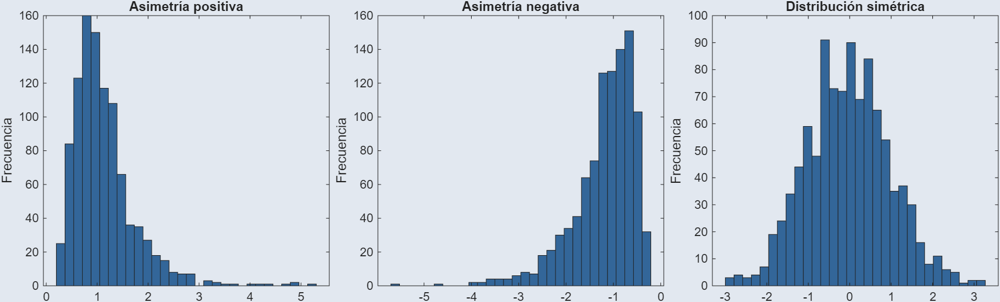
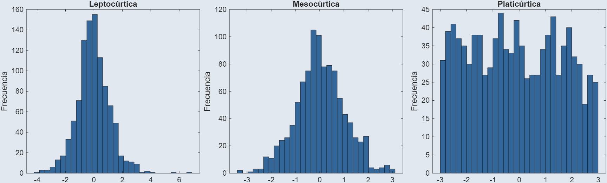

# Manejo de datos y medidas estadísticas {style="margin-top: 45px; font-size: 1.2em;"}

<h3 style="font-size: 1.0em;"> Medidas de tendencia central y posición </h3>

<h4 style="font-size: 0.6em; opacity: 0.6"> Septiembre 2026 </h4>

## Unidades temáticas {background-color="#e4e4e7" style="font-size: 1.0em;"}

- **Unidad 1:** Definiciones. Manejo de datos y medidas estadísticas
- **Unidad 2:** Probabilidad y muestreo
- **Unidad 3:** Variables aleatorias discretas y continuas y sus distribuciones
- **Unidad 4:** Distribuciones muestrales. Introducción a los intervalos de confianza
- **Unidad 5:** Análisis de regresión y correlación

## Definiciones. Manejo de datos y medidas estadísticas 

**1.** Introducción y conceptos fundamentales

**2.** Recolección, organización y representación gráfica de datos

**3. Medidas de tendencia central y posición**

**4.** Medidas de dispersión y de forma

## Medidas de tendencia central y posición

1. **Organización de datos**
   - Datos no agrupados vs. agrupados
   - Construcción de tablas de frecuencia
2. **Medidas de tendencia central**
   - Media muestral y media ponderada muestral
   - Mediana muestral y moda muestral
   - Valor atípico y media recortada
   - Criterios de selección según distribución y valores atípicos
3. **Medidas de posición**
   - Cuartiles, deciles y percentiles 
   - Diagrama de caja y bigotes 
4. **Comparación e interpretación**
   - Pertinencia de las medidas según distribución y valores atípicos

::: {background-image="image_files/bigdata.jpg" background-size="cover" background-position="center 30%"}

#

[Foto por <a href="https://www.pexels.com/photo/digital-monitor-flashing-stocks-exchange-11798249/">Romulo Queiroz</a> en <a href="https://www.pexels.com/@romulo-queiroz-2079642/">Pexels</a>]{.footer}

:::

# Organización de datos {background-color="#2d3748"}

Antes de calcular medidas de tendencia central y de posición, los datos deben organizarse según su naturaleza y volumen.

## Datos no agrupados vs. agrupados {background-color="#e2e8f0"}

1. **No agrupados** | Valores individuales, sin clasificar
2. **Agrupados** | Valores organizados en intervalos de clase

## Criterios de agrupación {background-color="#e2e8f0" style="font-size: 1.0em;"}

1. **Pertinencia** | Aplica a variables continuas o discretas con alta dispersión
2. **Número de clases (**$k$**)** | Se determina con Sturges o raíz cuadrada, evitando muy pocas o demasiadas clases
3. **Ancho constante (**$\omega$**)** | Todos los intervalos deben tener la misma amplitud
4. **Mutua exclusión** | Intervalos semiabiertos $[L_i, L_s)$, cada dato pertenece a una sola clase
5. **Exhaustividad** | El primer límite inferior $\leq x_{min}$; el último límite superior $\geq x_{max}$

## Número de clases [(repetida)]{style="font-size: 65%;"} {background-color="#e2e8f0"}

1. En este curso se usan: Sturges, $k = 1 + 3.322 \log(n)$, y raíz, $k = \sqrt{n}$
2. Otros criterios (empírica, Rice, Scott, Freedman-Diaconis) no se profundizan aquí
3. Muy pocas clases ocultan patrones; muy muchas fragmentan los datos

## Ancho de clase [(repetida)]{style="font-size: 65%;"} {background-color="#e2e8f0"}

::: {style="text-align: center; margin: 20px 0; font-size: 1.2em;"}
$$\text{ancho} = \omega = \frac{x_{max} - x_{min}}{k}$$
:::

1. Se **redondea hacia arriba** para cubrir todo el rango
2. Todas las clases deben tener el **mismo ancho**
3. Los límites no deben **superponerse** entre clases

# Elementos de una tabla de frecuencias {background-color="#2d3748"}

Estructura mínima que permite organizar datos agrupados en clases, con sus respectivas medidas de posición y conteo.

## Elementos de una tabla de frecuencias {background-color="#e2e8f0"}

1. **Clase (intervalo de clase)** | Rango de valores que agrupa un subconjunto de datos
2. **Marca de clase** | Punto medio del intervalo
3. **Límite inferior** | Valor mínimo de la clase
4. **Límite superior** | Valor máximo de la clase

# Frecuencia absoluta y relativa {background-color="#2d3748"}

Medidas que indican cuántas veces aparece un valor o clase y qué proporción representa respecto al total de datos.

## Frecuencia absoluta y relativa {background-color="#e2e8f0"}

1. **Frecuencia absoluta (**$f_i$**)** | Número de veces que aparece un valor o clase
2. **Frecuencia relativa (**$h_i$**)** | Proporción respecto al total, $h_i = f_i / n$
3. **Frecuencia acumulada absoluta (**$F_i$**)** | Suma de $f_i$ hasta la clase actual 
4. **Frecuencia acumulada relativa (**$H_i$**)** | Suma de $h_i$ hasta la clase actual 

 

| Clase | $f_i$ | $h_i$ | $F_i$ | $H_i$ |
|---|---|---|---|---|
| ... | ... | ... | ... | ... |

## Caso de estudio [(datos cuantitativos)]{style="font-size: 65%;"} {background-color="#f2f2f2"}

Al registrar el consumo eléctrico mensual (en kWh) de 50 viviendas de un mismo sector residencial, con un
mínimo de 183.6 kWh y un máximo de 419.4 kWh, se pide construir una tabla de frecuencias agrupando estos datos en clases.

## Datos [(consumo en kWh)]{style="font-size: 65%;"} {background-color="#f2f2f2"}

  
288.6

314.3

401.8

291.8

301.9

321.0

224.3

302.9

331.2

370.3

  
202.6

252.8

201.8

374.3

346.4

190.1

415.7

411.5

336.9

327.7

  
217.8

183.6

306.8

194.3

225.6

238.1

187.2

291.3

285.7

382.2

  
304.6

333.7

299.9

339.0

289.8

246.8

419.4

419.0

381.7

349.9

  
255.7

235.1

249.4

196.9

363.9

276.1

383.2

272.8

409.9

383.4

# Valor atípico {background-color="#2d3748"}

Observación que se aleja notablemente del resto de los datos, ya sea por un valor extremo o por una causa identificable (error, condición distinta, caso excepcional).

## Valor atípico {background-color="#e2e8f0"}

1. No hay una regla única para identificarlo; existen varios criterios (boxplot, z-score, entre otros)
2. Puede deberse a un **error de medición o registro** o a una observación genuinamente distinta
3. Afecta más a la **media** que a la mediana o la moda
4. No se debe eliminar sin antes **investigar su causa**

# Media muestral {background-color="#2d3748"}

Medida de tendencia central que resulta de sumar todos los valores de un conjunto de datos y dividir entre el número total de observaciones.

::: {style="text-align: center; margin: 20px 0; font-size: 1.3em;"}
$$\bar{x} = \frac{\sum_{i=1}^{n} x_i}{n}$$
:::

## Media muestral [(datos no agrupados)]{style="font-size: 65%;"} {background-color="#e2e8f0"}

::: {style="text-align: center; margin: 20px 0; font-size: 1.2em;"}
$$\bar{x} = \frac{\sum_{i=1}^{n} x_i}{n}$$
:::

1. Suma de todos los valores $x_i$, dividida entre el total de valores $n$
2. Sensible a **valores atípicos**
3. Aplica cuando se conocen los **valores individuales**

## Media muestral [(datos agrupados)]{style="font-size: 65%;"} {background-color="#e2e8f0"}

::: {style="text-align: center; margin: 20px 0; font-size: 1.2em;"}
$$\bar{x} = \frac{\sum_{i=1}^{k} f_i \cdot m_i}{n}$$
:::

::: {style="border-left: 2px solid #888; padding-left: 15px; line-height: 1.8;"}
$m_i$, marca de clase  
$f_i$, frecuencia de la clase  
$k$, número de clases  
$n$, tamaño de la muestra
:::
 
La media muestral es una **aproximación**, no el valor exacto

## Caso de estudio [(retomando el consumo eléctrico)]{style="font-size: 65%;"} {background-color="#f2f2f2"}

Con los 50 datos de consumo eléctrico mensual (kWh) ya presentados, calcule la media aritmética como dato no agrupado y compárela con la media obtenida al agrupar los datos en la tabla de frecuencias ya construida.

# Media ponderada muestral {background-color="#2d3748"}

Media aritmética muestral donde cada valor se multiplica por un peso que refleja su importancia relativa dentro del conjunto.

::: {style="text-align: center; margin: 20px 0; font-size: 1.3em;"}
$$\bar{x}_w = \frac{\sum_{i=1}^{n} w_i \cdot x_i}{\sum_{i=1}^{n} w_i}$$
:::

## Media ponderada muestral {background-color="#e2e8f0"}

::: {style="text-align: center; margin: 20px 0;  font-size: 1.2em;"}
$$\bar{x}_w = \frac{\sum_{i=1}^{n} w_i \cdot x_i}{\sum_{i=1}^{n} w_i}$$
:::

1. $w_i$, peso o importancia asignada a cada valor
2. Se usa cuando **no todos los datos pesan igual**

## Caso de estudio [(tasa de defectos por planta)]{style="font-size: 65%;"} {background-color="#f2f2f2"}

Una empresa tiene 4 plantas con distinta tasa de defectos por lote y distinto volumen de producción mensual. Se pide calcular la tasa de defectos promedio de la empresa, ponderada por volumen.

| Planta | Tasa de defectos (%) | Volumen (unidades) |
|---|---:|---:|
| A | 1.2 | 8,000 |
| B | 2.5 | 3,000 |
| C | 0.8 | 12,000 |
| D | 3.1 | 2,000 |

# Mediana muestral {background-color="#2d3748"}

Valor que divide un conjunto de datos ordenados en dos partes iguales: la mitad de las observaciones queda por debajo y la mitad por encima.

::: {style="text-align: center; margin: 20px 0; font-size: 1.2em;"}
$$Me = \begin{cases} x_{\left(\frac{n+1}{2}\right)} & n \text{ impar} \\[6pt] \dfrac{x_{\left(\frac{n}{2}\right)} + x_{\left(\frac{n}{2}+1\right)}}{2} & n \text{ par} \end{cases}$$
:::

## Mediana muestral [(datos no agrupados)]{style="font-size: 65%;"} {background-color="#e2e8f0"}

1. Se ordenan los datos de **menor a mayor**
2. Si $n$ es impar, el valor central
3. Si $n$ es par, promedio de los dos valores centrales
4. No se ve afectada por **valores atípicos**

## Mediana muestral [(datos agrupados)]{style="font-size: 65%;"} {background-color="#e2e8f0"}

::: {style="text-align: center; margin: 20px 0; font-size: 1.2em;"}
$$Me = L_i + \left( \frac{\frac{n}{2} - F_{i-1}}{f_i} \right) \cdot \omega$$
:::

::: {style="border-left: 2px solid #888; padding-left: 15px; line-height: 1.8;"}
$L_i$, límite inferior de la clase mediana  
$F_{i-1}$, frecuencia acumulada de la clase anterior  
$f_i$, frecuencia de la clase mediana  
$\omega$, ancho de clase  
$n$, tamaño de la muestra
:::

# Moda muestral {background-color="#2d3748"}

Valor o clase que se presenta con mayor frecuencia dentro de un conjunto de datos.

## Moda muestral [(datos no agrupados)]{style="font-size: 65%;"} {background-color="#e2e8f0"}

1. Valor que **más se repite** en el conjunto de datos
2. Puede no existir o haber más de una (bimodal, multimodal)
3. Es la única medida de tendencia central aplicable a datos **cualitativos**

## Moda muestral [(datos agrupados — usando frecuencias)]{style="font-size: 65%;"} {background-color="#e2e8f0"}

::: {style="text-align: center; margin: 20px 0; font-size: 1.2em;"}
$$Mo = L_i + \left( \frac{f_i - f_{i-1}}{2f_i - f_{i-1} - f_{i+1}} \right) \cdot \omega$$
:::

::: {style="border-left: 2px solid #888; padding-left: 15px; line-height: 1.8;"}
$L_i$, límite inferior de la clase modal  
$f_{i-1}$, frecuencia de la clase anterior  
$f_i$, frecuencia de la clase modal  
$f_{i+1}$, frecuencia de la clase siguiente  
$\omega$, ancho de clase
:::

## Moda muestral [(datos agrupados — fórmula de Pearson)]{style="font-size: 65%;"} {background-color="#e2e8f0"}

::: {style="text-align: center; margin: 20px 0; font-size: 1.2em;"}
$$Mo = 3 Me - 2 \bar{x}$$
:::

1. Estimación indirecta usando **media** y **mediana** ya calculadas
2. Válida solo bajo el supuesto de una distribución **moderadamente asimétrica**
3. No requiere identificar la clase modal directamente

## Caso de estudio [(comparación de métodos)]{style="font-size: 65%;"} {background-color="#f2f2f2"}

Retomando la tabla de frecuencias del consumo eléctrico, calcule la moda usando el método de distancias y la fórmula de Pearson. Compare los resultados.

¿Coinciden? ¿Qué método le parece más confiable para este conjunto de datos, por qué?

::: {background-image="image_files/measurement.jpg" background-size="cover" background-position="center 30%"}

#

[Foto por <a href="https://www.pexels.com/es-es/foto/primer-plano-de-un-comparador-de-cuadrante-mitutoyo-en-el-taller-38291710/">Adinath Gilande</a> en <a href="https://www.pexels.com/es-es/@adinath-gilande-617966960/">Pexels</a>]{.footer}

:::

# Criterios de selección {background-color="#2d3748"}

Ninguna medida de tendencia central es universalmente mejor; la elección depende de la forma de los datos y la presencia de valores atípicos.

## ¿Cuál medida usar? {background-color="#e2e8f0" style="font-size: 1.0em;"}

| Situación | Medida recomendada |
|---|---|
| Distribución simétrica, sin atípicos | Media |
| Presencia de valores atípicos | Mediana |
| Datos cualitativos | Moda |
| Distribución muy asimétrica | Mediana |

## Caso de estudio [(sensibilidad de la media)]{style="font-size: 65%;"} {background-color="#f2f2f2"}

Un sensor registra automáticamente el peso (en gramos) de 12 empaques de un producto durante una hora de producción, como parte de un control de calidad continuo.

  
12.1

11.9

12.3

12.0

11.8

12.2

  
12.4

11.7

45.6

12.1

11.9

12.0

Calcule la media con los 12 datos y compárela con la media excluyendo el noveno registro. ¿Qué pudo haber causado ese valor? ¿Debería excluirse sin más?

# Media recortada {background-color="#2d3748"}

Media aritmética calculada tras eliminar un porcentaje igual de valores en cada extremo de los datos ordenados, para reducir la influencia de valores atípicos.

## Media recortada {background-color="#e2e8f0"}

1. Se ordenan los datos y se **recorta un p%** de cada extremo
2. Se calcula la media aritmética de los valores restantes
3. Valores comunes: recortes al **5%**, **10%** o **20%**
4. La mediana es un caso extremo: recorta todo excepto el valor central

## Caso de estudio [(retomando los empaques)]{style="font-size: 65%;"} {background-color="#f2f2f2"}

Con los 12 datos de peso de empaques ya presentados, calcule la media recortada al 10%. Recuerde: $n \cdot p / 100 = 12 \cdot 10 / 100 = 1.2$, que se redondea a 1 dato por extremo.

Compare este resultado con la media sin recortar (14.83 g) y con la media excluyendo manualmente el valor atípico (12.04 g).

# Medidas de posición {background-color="#2d3748"}

Valores que dividen un conjunto de datos ordenados en partes proporcionales, permitiendo ubicar una observación en relación con el resto.

## Cuartiles, deciles y percentiles {background-color="#e2e8f0"}

1. **Cuartiles ($Q_1, Q_2, Q_3$)** | Dividen los datos en 4 partes iguales
2. **Deciles ($D_1, \ldots, D_9$)** | Dividen los datos en 10 partes iguales
3. **Percentiles ($P_1, \ldots, P_{99}$)** | Dividen los datos en 100 partes iguales

## Posición [(datos no agrupados)]{style="font-size: 65%;"} {background-color="#e2e8f0"}

::: {style="text-align: center; margin: 20px 0; font-size: 1.2em;"}
$$\text{Posición} = \frac{k \cdot n}{m}$$
:::

::: {style="border-left: 2px solid #888; padding-left: 15px; line-height: 1.8;"}
$k$, número del cuartil/decil/percentil buscado  
$m$, total de divisiones (4, 10 o 100)
:::

  Datos ordenados de menor a mayor antes de aplicar la fórmula

## Posición [(datos agrupados)]{style="font-size: 65%;"} {background-color="#e2e8f0"}

::: {style="text-align: center; margin: 20px 0; font-size: 1.2em;"}
$$P_k = L_i + \left( \frac{\frac{k \cdot n}{m} - F_{i-1}}{f_i} \right) \cdot \omega$$
:::

::: {style="border-left: 2px solid #888; padding-left: 15px; line-height: 1.8;"}
$L_i$, límite inferior de la clase donde cae la posición  
$k$, número del cuartil/decil/percentil buscado  
$m$, total de divisiones (4, 10 o 100)  
$F_{i-1}$, frecuencia acumulada de la clase anterior  
$f_i$, frecuencia de la clase  
$\omega$, ancho de clase
:::
 
Misma estructura que la mediana, cambiando la posición buscada

# Diagrama de caja y bigotes {background-color="#2d3748"}

Representación gráfica que resume la posición, dispersión y simetría de un conjunto de datos a partir de sus cuartiles.

## Rango intercuartílico {background-color="#e2e8f0"}

::: {style="text-align: center; margin: 20px 0; font-size: 1.2em;"}
$$RIC = Q_3 - Q_1$$
:::

1. Mide la **dispersión del 50% central** de los datos
2. Menos sensible a valores atípicos que el rango total
3. Se usa para definir los límites del boxplot

## Elementos del boxplot {background-color="#e2e8f0"}

1. **Caja** | De $Q_1$ a $Q_3$, con una línea en $Q_2$ (mediana)
2. **Bigotes** | Se extienden hasta 1.5 veces el RIC desde la caja
3. **Valores atípicos** | Aquellos puntos fuera del alcance de los bigotes

## Boxplot [(construcción)]{style="font-size: 65%;"} {background-color="#e2e8f0"}

1. **Rango intercuartílico** | $RIC = Q_3 - Q_1$
2. **Límite inferior del bigote** | $Q_1 - 1.5 \cdot RIC$
3. **Límite superior del bigote** | $Q_3 + 1.5 \cdot RIC$

 
Cualquier dato fuera de ese rango se marca como **atípico**

## Caso de estudio [(tiempos de reparación)]{style="font-size: 65%;"} {background-color="#f2f2f2"}

Se registró el tiempo de reparación (en horas) de 43 órdenes de mantenimiento correctivo en una planta durante un mes. Se pide calcular cuartiles, RIC y construir el diagrama de caja y bigotes correspondiente.

## Datos [(horas de reparación)]{style="font-size: 65%;"} {background-color="#f2f2f2"}

  
0.3

2.2

2.3

2.4

2.4

2.4

2.5

2.5

2.6

2.8

  
2.8

2.9

3.0

3.2

3.3

3.5

3.9

4.0

4.0

4.1

  
4.4

4.4

4.6

4.8

4.8

4.8

5.3

5.5

5.6

5.8

  
5.8

5.8

6.1

6.2

6.2

6.4

7.3

7.4

7.6

8.2

  
8.3

15.2

16.8

::: {background-image="image_files/cripto.jpg" background-size="cover" background-position="center 30%"}

#

[Foto por <a href="https://www.pexels.com/es-es/@thales13/">Rafael Minguet Delgado</a> en <a href="https://www.pexels.com/es-es/foto/primer-plano-de-graficos-de-negociacion-de-criptomonedas-38375327/">Pexels</a>]{.footer}

:::

# Medidas de dispersión {background-color="#2d3748"}

Cuantifican qué tan dispersos o concentrados están los datos respecto a una medida de tendencia central.

## Rango {background-color="#e2e8f0"}

::: {style="text-align: center; margin: 20px 0; font-size: 1.2em;"}
$$R = x_{max} - x_{min}$$
:::

1. Medida de dispersión **más simple**
2. Usa solo los valores extremos, ignora el resto
3. Muy sensible a **valores atípicos**

## Población vs. muestra [(notación)]{style="font-size: 65%;"} {background-color="#e2e8f0"}

1. **Población** | $\mu$ (media), $\sigma^2$ (varianza), $\sigma$ (desviación estándar)
2. **Muestra** | $\bar{x}$ (media), $s^2$ (varianza), $s$ (desviación estándar)

# Varianza {background-color="#2d3748"}

Medida que cuantifica el promedio de las desviaciones al cuadrado respecto a la media, expresando la dispersión en unidades al cuadrado.

## Varianza poblacional {background-color="#e2e8f0"}

::: {style="text-align: center; margin: 20px 0; font-size: 1.2em;"}
$$\sigma^2 = \frac{\sum_{i=1}^{N} (x_i - \mu)^2}{N}$$
:::

::: {style="border-left: 2px solid #888; padding-left: 15px; line-height: 1.8;"}
$\mu$, media poblacional  
$N$, tamaño de la población
:::
 
Se usa cuando se tienen **todos** los datos de la población

## Varianza muestral {background-color="#e2e8f0"}

::: {style="text-align: center; margin: 20px 0; font-size: 1.2em;"}
$$s^2 = \frac{\sum_{i=1}^{n} (x_i - \bar{x})^2}{n - 1}$$
:::

::: {style="border-left: 2px solid #888; padding-left: 15px; line-height: 1.8;"}
$\bar{x}$, media muestral  
$n-1$, corrección de Bessel
:::

## Corrección de Bessel {background-color="#e2e8f0"}

1. La varianza muestral usa $n-1$ en vez de $n$ en el denominador
2. Sin la corrección, $s^2$ **subestima** sistemáticamente la varianza poblacional
3. $n-1$ compensa la pérdida de un grado de libertad al estimar $\bar{x}$ desde la misma muestra

## Desviación estándar {background-color="#e2e8f0"}

::: {style="text-align: center; margin: 20px 0; font-size: 1.2em;"}
$$\sigma = \sqrt{\sigma^2} \qquad s = \sqrt{s^2}$$
:::

1. Raíz cuadrada de la varianza
2. Expresada en las **mismas unidades** que los datos originales
3. Medida de dispersión más usada en la práctica

## Coeficiente de variación {background-color="#e2e8f0"}

::: {style="text-align: center; margin: 20px 0; font-size: 1.2em;"}
$$CV = \frac{\sigma}{\mu} \cdot 100\% \qquad CV = \frac{s}{\bar{x}} \cdot 100\%$$
:::

1. Dispersión relativa a la media, expresada en **porcentaje**
2. Permite comparar dispersión entre conjuntos con **unidades distintas**
3. No tiene sentido si $\mu$ (o $\bar{x}$) es cercano a cero

## Caso de estudio [(retomando tiempos de reparación)]{style="font-size: 65%;"} {background-color="#f2f2f2"}

Con los 43 datos de tiempo de reparación ya presentados, calcule el rango, la varianza muestral y la desviación estándar muestral. Note el efecto de los dos valores atípicos (15.2 y 16.8) sobre estos resultados.

## Caso de estudio [(comparando dispersión relativa)]{style="font-size: 65%;"} {background-color="#f2f2f2"}

Se comparan dos variables de una planta: el tiempo de reparación (horas) y el costo de repuestos por orden (pesos). ¿Cuál de las dos tiene mayor dispersión relativa?

| Variable | Media | Desviación estándar |
|---|-----:|---:|
| Tiempo de reparación | 5.0 h | 3.0 h |
| Costo de repuestos | $2250000 | $360000 |

¿Tiene sentido comparar directamente 3.0 con 360000?

# Asimetría {background-color="#2d3748"}

Mide el grado en que una distribución se aleja de la simetría, indicando si los datos se concentran más hacia un lado de la media.

## Coeficiente de asimetría de Fisher {background-color="#e2e8f0"}

::: {style="text-align: center; margin: 20px 0; font-size: 1.2em;"}
$$g_1 = \frac{\frac{1}{n}\sum_{i=1}^{n}(x_i - \bar{x})^3}{s^3}$$
:::

::: {style="border-left: 2px solid #888; padding-left: 15px; line-height: 1.8;"}
$g_1 = 0$, distribución **simétrica**  
$g_1 > 0$, asimetría **positiva** (cola hacia la derecha)  
$g_1 < 0$, asimetría **negativa** (cola hacia la izquierda)
:::

## Formas según asimetría {background-color="#e2e8f0"}

::: {style="text-align: center;"}
{width="120%"}
:::

# Curtosis {background-color="#2d3748"}

Mide qué tan concentrados o dispersos están los datos alrededor de la media, en comparación con una distribución normal, reflejando el peso de las colas.

## Coeficiente de curtosis {background-color="#e2e8f0"}

::: {style="text-align: center; margin: 20px 0; font-size: 1.2em;"}
$$g_2 = \frac{\frac{1}{n}\sum_{i=1}^{n}(x_i - \bar{x})^4}{s^4} - 3$$
:::

::: {style="border-left: 2px solid #888; padding-left: 15px; line-height: 1.8;"}
$g_2 = 0$, **mesocúrtica** (similar a la normal)  
$g_2 > 0$, **leptocúrtica** (colas pesadas, más apuntada)  
$g_2 < 0$, **platicúrtica** (colas ligeras, más achatada)
:::

## Formas según curtosis {background-color="#e2e8f0"}

::: {style="text-align: center;"}
{width="120%"}
:::

## Asimetría y las medidas de tendencia central {background-color="#e2e8f0"}

::: {style="border-left: 2px solid #888; padding-left: 15px; line-height: 1.8;"}
Asimetría positiva: Media $>$ Mediana $>$ Moda  
Asimetría negativa: Media $<$ Mediana $<$ Moda  
Simétrica: Media $\approx$ Mediana $\approx$ Moda
:::

## ¿Cuál medida usar? {background-color="#e2e8f0" style="font-size: 1.0em;"}

| Situación | Medida recomendada |
|---|---|
| Distribución simétrica, sin atípicos | Media |
| Presencia de valores atípicos | Mediana |
| Datos cualitativos | Moda |
| Distribución muy asimétrica | Mediana |

## Caso de estudio [(retomando tiempos de reparación)]{style="font-size: 65%;"} {background-color="#f2f2f2"}

Con los 43 datos de tiempo de reparación ya presentados, calcule el coeficiente de asimetría y el de curtosis. Relacione el resultado con los valores atípicos ya identificados en el boxplot.

# Puntuación estandarizada (z-score) {background-color="#2d3748"}

Indica cuántas desviaciones estándar se aleja un valor de la media, permitiendo comparar datos de distintas distribuciones en una misma escala.

## z-score {background-color="#e2e8f0"}

::: {style="text-align: center; margin: 20px 0; font-size: 1.2em;"}
$$z = \frac{x - \mu}{\sigma} \qquad z = \frac{x - \bar{x}}{s}$$
:::

::: {style="border-left: 2px solid #888; padding-left: 15px; line-height: 1.8;"}
$z = 0$, el valor **coincide** con la media  
$z > 0$, por encima de la media; $z < 0$, por debajo  
$|z| > 2$, criterio **estricto** para detectar atípicos  
$|z| > 3$, criterio **común**, solo desviaciones extremas
:::

 
Como criterio de atípicos, supone una distribución **aproximadamente simétrica**. Con datos muy asimétricos, conviene usar el boxplot en su lugar

## Caso de estudio [(retomando tiempos de reparación)]{style="font-size: 65%;"} {background-color="#f2f2f2"}

Calcule el z-score de una orden que tomó 15.2 horas y de otra que tomó 5.5 horas, usando la media y desviación estándar ya calculadas ($\bar{x} = 4.99$, $s = 3.08$).

# Comparación e interpretación {background-color="#2d3748"}

Ninguna medida por sí sola describe completamente un conjunto de datos: tendencia central, posición y dispersión se complementan.

## Qué aporta cada grupo de medidas {background-color="#e2e8f0" style="font-size: 1.0em;"}

| Grupo | Qué responde |
|---|---|
| Tendencia central | ¿Dónde se concentran los datos? |
| Posición | ¿Dónde cae un dato respecto al resto? |
| Dispersión | ¿Qué tan esparcidos están los datos? |
| Asimetría y curtosis | ¿Qué forma tiene la distribución? |

## Caso de estudio [(síntesis)]{style="font-size: 65%;"} {background-color="#f2f2f2"}

Retomando los 43 datos de tiempo de reparación, presente un resumen completo: media, mediana, moda, cuartiles, RIC, desviación estándar, asimetría y curtosis. A partir de ese resumen, redacte una conclusión sobre el comportamiento del proceso de mantenimiento.

